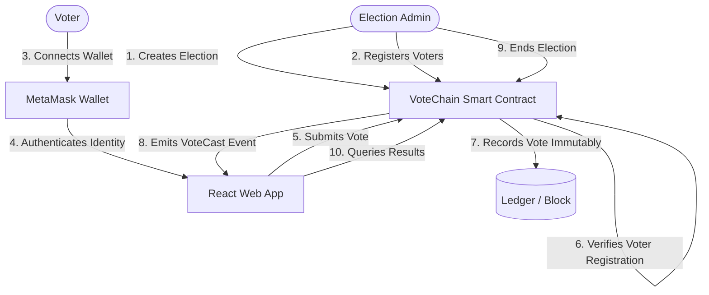

# VoteChain: Decentralized E-Voting System using Blockchain

Welcome to **VoteChain**, a secure, transparent, and immutable electronic voting system powered by decentralized blockchain technology. This document outlines the project's conceptual design, architectural components, implementation details, and deployment guidelines.

---

## 📖 1. Project Abstract
Online voting is a trend that is gaining momentum in modern society. It has great potential to decrease organizational costs and increase voter turnout by eliminating the need to print ballot papers or open physical polling stations—voters can cast their votes from anywhere with an Internet connection. 

Despite these benefits, traditional online voting solutions are viewed with caution due to centralized vulnerabilities: a single security breach can lead to large-scale vote manipulation. To be viable, electronic voting systems must be **legitimate, accurate, safe, and convenient**.

**VoteChain** addresses these critical security and transparency requirements by leveraging **Blockchain technology**. By using decentralized nodes and smart contracts, VoteChain provides end-to-end verification, non-repudiation, and auditability. The system uses a permissioned approach and consensus algorithms to guarantee security, maintain voter anonymity, and deliver high transaction throughput.

---

## 🎯 2. Introduction & Motivation
Voting forms the basis of democracy. However, current systems—both paper-based and traditional electronic voting—face issues regarding transparency, auditability, and trust. Direct Recording Electronic (DRE) voting machines often do not generate verifiable receipts, and recounting processes lack public transparency.

### ❖ Key Features of VoteChain Blockchain
*   **High Availability:** Distributed ledger guarantees that the system is resilient to single-point-of-failure attacks.
*   **Verifiability:** Voters can verify that their vote was recorded and counted without exposing their identity.
*   **Transparency:** Publicly verifiable election logic using open-source Ethereum Smart Contracts.
*   **Immutability:** Once written to the blockchain, voting logs cannot be altered, deleted, or falsified.
*   **Distributed Ledgers:** Copies of the ledger are synchronized across validating nodes.
*   **Decentralized:** Eliminates dependency on a central database/authority prone to corruption.
*   **Enhanced Security:** Cryptographic hashing and digital signatures secure all voter records and transactions.

---

## 🔭 3. System Scope
The scope of VoteChain is highly adaptable and can be scaled to fit:
*   **University & School Elections:** Electing student representatives.
*   **Corporate & Organization Governance:** Shareholder voting and board elections.
*   **Local Governance & Civil Bodies:** Public polling and administrative elections.

VoteChain implements strong encryption techniques to protect voter privacy while generating completely tamper-free results.

---

## 🛠️ 4. System Architecture & Workflow

The architecture splits logic between a **Vite + React Frontend** and an **Ethereum Virtual Machine (EVM) Smart Contract** written in **Solidity**.

### 📊 Voter & Admin Flow Diagram



### 🔐 Transaction Verification Lifecycle
1.  **Authentication:** Voter logs in via MetaMask using their private key.
2.  **State Check:** The smart contract checks if the voter is registered and has not voted yet.
3.  **Vote Submission:** The voter casts their vote; a transaction hash is generated.
4.  **Consensus:** Validating nodes approve the block containing the vote.
5.  **Tallying:** The smart contract updates the candidate's vote count in real-time, instantly visible after the block is mined.

---

## ⛓️ 5. Blockchain Network Design

VoteChain is designed to operate on a **Permissioned Hybrid/Private Blockchain** utilizing the **Proof of Authority (PoA)** consensus algorithm.

| Blockchain Type | Access Restrictions | Transaction Speed | Verification Costs | Ideal Use Case |
| :--- | :--- | :--- | :--- | :--- |
| **Public** | None (Anyone can join) | Slower | High Gas Fees | Public DeFi, Bitcoin, Ethereum Mainnet |
| **Private/Permissioned** | Strict (Admin Invitation) | Very Fast | Zero/Low Gas Fees | Enterprise, VoteChain local/private nodes |
| **Hybrid** | Mixed (Public Read / Private Write) | Fast | Moderate | Cross-organization consensus |

### Why Proof of Authority (PoA)?
*   **High Performance:** Transactions are approved by designated validators, leading to short block times and high throughput.
*   **Zero/Predictable Cost:** Eliminates expensive transaction fees typical of public proof-of-work/stake blockchains.
*   **Access Control:** Only authorized citizens/voters can interact, preventing external network spamming.
*   **Privacy Preservation:** Voter identity data remains off-chain or heavily encrypted, with only anonymous cryptographic keys interacting with the ledger.

---

## 💻 6. Implementation Tech Stack

### Tools & Technologies
*   **Solidity:** Language used to write the `VoteChain` smart contract, ensuring immutable execution of election rules.
*   **Hardhat:** Node.js development environment used to compile, test, and deploy smart contracts.
*   **MetaMask Wallet:** Browser extension used by voters and admins to sign transactions securely.
*   **Ethers.js:** Library connecting the frontend user interface to the EVM network.
*   **React + Vite:** Premium frontend framework for building a responsive, high-performance web dashboard.

---

## 🚀 7. Execution & Setup Instructions

### 📥 7.1. Installation
To install the dependencies for both directories, run the following commands:

```powershell
# Install Smart Contract dependencies
cd "smart contract"
npm install

# Install Frontend dependencies
cd ../frontend
npm install
```

### ⚙️ 7.2. Environment Setup
Configure your environment variables in both directories:
*   **Smart Contract Configuration:** Copy [smart contract/.env.example](file:///d:/WorkSpace/Project/E%20voting%20sytem/smart%20contract/.env.example) to `.env` and fill in your keys:
    ```env
    ALCHEMY_API_URL="https://eth-sepolia.g.alchemy.com/v2/YOUR_API_KEY"
    PRIVATE_KEY="YOUR_WALLET_PRIVATE_KEY"
    ETHERSCAN_API_KEY="YOUR_ETHERSCAN_API_KEY"
    ```
*   **Frontend Configuration:** Copy [frontend/.env.example](file:///d:/WorkSpace/Project/E%20voting%20sytem/frontend/.env.example) to `.env` and add the deployed contract address:
    ```env
    VITE_CONTRACT_ADDRESS="YOUR_DEPLOYED_CONTRACT_ADDRESS"
    ```

### 🛰️ 7.3. Deployment

#### 🖥️ Local Network Deployment
1. Start the Hardhat Node:
   ```powershell
   cd "smart contract"
   npx hardhat node
   ```
2. In a new terminal window, deploy the contract locally:
   ```powershell
   cd "smart contract"
   npx hardhat run scripts/deploy.js --network localhost
   ```

#### 🌐 Sepolia Testnet Deployment
Deploy directly to the Sepolia test network:
```powershell
cd "smart contract"
npx hardhat run scripts/deploy.js --network sepolia
```

### 💻 7.4. Running the Frontend
Start the local Vite development server:
```powershell
cd frontend
npm run dev
```

---

## 🏁 8. Conclusion
**VoteChain** addresses the inefficiencies of conventional voting systems by substituting them with a transparent, cost-efficient, and secure blockchain framework. By integrating smart contracts, voter registration verification, and decentralized consensus:
*   Physical paper audit trails are replaced with immutable cryptographic records.
*   Administrative overheads are minimized.
*   Voter trust is fortified by guaranteeing that every cast vote is counted accurately.

For national-scale deployments, future optimizations will involve adding **Zero-Knowledge Proofs (ZKPs)** to further hide voter choice details while proving validity, and implementing sidechains to manage massive transaction volumes.
