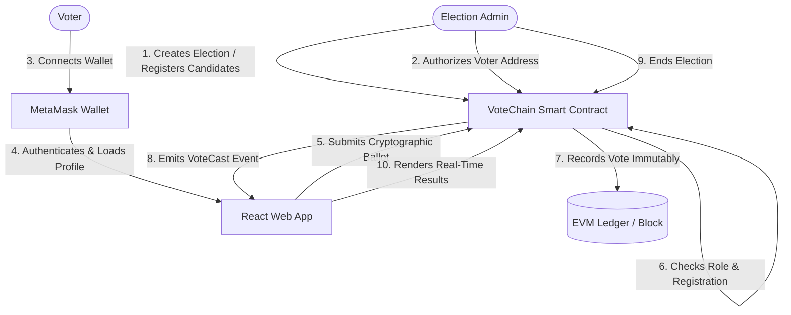

# VoteChain: Secure & Decentralized E-Voting System

<p align="center">
  
</p>

Welcome to **VoteChain**, an advanced, secure, and transparent electronic voting system built on decentralized blockchain technology. This repository hosts a complete decentralized application (dApp) containing Ethereum-based smart contracts and a premium React-Vite web frontend.

---

## 📖 1. Project Abstract & Motivation

Voting is the cornerstone of democracy, yet traditional voting systems—both paper-based and digital—face issues of trust, auditing integrity, high organization costs, and security vulnerabilities. Centralized digital voting systems are highly susceptible to database breaches and administrator manipulation.

**VoteChain** addresses these critical vulnerabilities by employing a distributed ledger and immutable smart contracts:
*   **Tamper-Proof Ledger:** Every vote is cast as a transaction, verified by network validators, and recorded immutably.
*   **Voter Anonymity & Privacy:** Voters are identified by cryptographic public addresses; voting choices are decoupled from personal identity details on-chain.
*   **Real-Time Auditability:** The election logic is defined by public smart contracts, enabling candidates and citizens to perform independent audits of the votes in real time.
*   **Role-Based Administration:** Election creation, candidate registration, and voter authorization are strictly governed via role-based access control.

---

## 🛠️ 2. System Architecture & Workflow

VoteChain's architecture connects a **Vite + React Frontend** directly to an **Ethereum Virtual Machine (EVM) Smart Contract** written in **Solidity** using the **Ethers.js** library and **MetaMask** wallet.

### 📊 System Workflow Diagram



### 🔐 Transaction Verification Lifecycle
1.  **Authorization:** The Admin uses the smart contract to pre-register voter addresses for an election.
2.  **Wallet Connection:** The voter connects MetaMask to the web app, verifying their active address.
3.  **Validation Check:** The smart contract checks if the caller is registered and hasn't voted yet.
4.  **Transaction Execution:** The voter signs a transaction selecting a candidate; the transaction is sent to the blockchain.
5.  **Consensus & Mining:** The transaction is included in a block, updating candidate tallies and emitting block events.
6.  **Real-Time Update:** The frontend listens to the `VoteCast` event and updates live stats instantly.

---

## ⛓️ 3. Smart Contract Design

The smart contract is written in **Solidity (^0.8.24)** and uses **OpenZeppelin** libraries to ensure security, standard compatibility, and optimal gas utilization.

### 🗂️ Contract File
*   [VoteChain.sol](smart%20contract/contracts/VoteChain.sol)

### 🧩 Structural Components

#### 1. Data Structures
*   `Candidate`: Holds identifier (`id`), display `name`, political `party`, candidate `imageUrl` representation, `voteCount`, and an existence flag.
*   `Voter`: Tracks registration status (`isRegistered`), vote tracking (`hasVoted`), and the selected candidate ID (`votedCandidateId`).
*   `Election`: Represents an election instance containing a metadata title, description, time boundaries (`startTime`/`endTime`), active state, total votes cast, and list of associated candidate IDs.
*   `ElectionStatus` (Enum): Manages election lifecycle phase: `NotStarted`, `Active`, `Ended`.

#### 2. Key Custom Errors (Gas-Optimized)
Instead of expensive string-based reverts, the contract employs custom errors:
*   `VoteChain__InvalidTime()`: Triggered when start/end bounds are illogical or in the past.
*   `VoteChain__ElectionNotExists()`: Querying or interacting with a non-existent election ID.
*   `VoteChain__ElectionNotActive()`: Attempting to vote when the status is not `Active`.
*   `VoteChain__ElectionAlreadyActive()`: Trying to start an election that has already run.
*   `VoteChain__ElectionEnded()`: Voting after the block time exceeds the election's `endTime`.
*   `VoteChain__CandidateNotExists()`: Voting for a candidate ID that isn't registered.
*   `VoteChain__VoterAlreadyRegistered()`: Attempting to register an authorized voter twice.
*   `VoteChain__VoterNotRegistered()`: Non-registered caller attempting to vote.
*   `VoteChain__AlreadyVoted()`: Voter attempting to submit multiple ballots in the same election.

#### 3. Administrative Functions (Role-Based)
Governed by `ELECTION_MANAGER_ROLE` and `DEFAULT_ADMIN_ROLE`:
*   `createElection(title, description, startTime, endTime)`: Registers a new election layout.
*   `addCandidate(electionId, name, party, imageUrl)`: Appends a candidate to an election.
*   `registerVoter(electionId, voter)`: Grants voting authorization to a specific public key address.
*   `startElection(electionId)` / `endElection(electionId)`: Manually triggers lifecycle shifts overriding standard block times.
*   `pause()` / `unpause()`: Inherited from `Pausable` for administrative emergency overrides.

#### 4. Public View Functions
*   `getAllCandidates(electionId)`: Retrieves all registered candidates.
*   `getWinner(electionId)`: Returns the leading candidate model for an election.
*   `getElectionDetails(electionId)`: Fetches configuration parameters of the election.
*   `isRegisteredVoter(electionId, voter)` / `hasVoted(electionId, voter)`: Public validation statuses.

---

## 💻 4. Frontend Application

The user interface is built as a single-page app utilizing **React**, **Vite**, and **Tailwind CSS**, designed with a premium zinc-based glassmorphism layout (high contrast, minimalist dark details, and smooth micro-animations).

### 🗂️ Architecture Layout
*   [blockchain.js](frontend/src/services/blockchain.js): Main service library containing the compiled contract ABI, custom hex selector error mapping, and low-level Ethers.js providers.
*   [WalletContext.jsx](frontend/src/context/WalletContext.jsx): React Context Provider managing MetaMask accounts, loading indicators, active role state (`isAdmin`), and wrapping smart contract operations with local callback state synchronization.
*   [index.css](frontend/src/index.css): Implements core layout variables, premium scrollbars, typography overrides (Inter & Syne fonts), and custom card components (`.glass-card`).

### 📑 User Interface Pages
*   **Home Dashboard ([Home.jsx](frontend/src/pages/Home.jsx)):** Landing page detailing project metrics, live connection status, and direct call-to-actions.
*   **Elections Overview ([Elections.jsx](frontend/src/pages/Elections.jsx)):** Search and view lists of current, upcoming, and past elections.
*   **Candidate Panel ([Candidates.jsx](frontend/src/pages/Candidates.jsx)):** View candidates and profiles before voting.
*   **Voting Booth ([VotePage.jsx](frontend/src/pages/VotePage.jsx)):** Secure casting panel verifying registration, status checks, and sending transaction request payloads to MetaMask.
*   **Real-time Results ([Results.jsx](frontend/src/pages/Results.jsx)):** Renders candidate tallies, voting percentages, and highlights current winners using beautiful CSS graph components.
*   **Admin Dashboard ([AdminDashboard.jsx](frontend/src/pages/AdminDashboard.jsx)):** Consolidated workspace for managers to create elections, add candidates, authorize voter addresses, and toggle election status.

---

## 🚀 5. Execution & Setup Instructions

Follow these step-by-step instructions to compile, test, deploy, and execute the complete VoteChain workspace locally.

### 📋 Prerequisites
Make sure you have the following installed on your machine:
*   [Node.js](https://nodejs.org/) (v18.x or later)
*   [MetaMask Browser Extension](https://metamask.io/)

---

### 📥 5.1. Installation

Navigate to each workspace folder to install required dependencies:

```powershell
# 1. Clone/Open the project directory
# 2. Install Smart Contract Environment dependencies
cd "smart contract"
npm install

# 3. Install Frontend Application dependencies
cd ../frontend
npm install
```

---

### ⚙️ 5.2. Environment Configuration

Copy the example environment configurations and edit with your custom variables:

1.  **Smart Contract Configuration:**
    *   Duplicate `smart contract/.env.example` as `smart contract/.env`.
    *   Set your Alchemy Sepolia Testnet nodes and developer keys (optional for local deployments):
    ```env
    ALCHEMY_API_URL="https://eth-sepolia.g.alchemy.com/v2/YOUR_API_KEY"
    PRIVATE_KEY="YOUR_WALLET_PRIVATE_KEY"
    ETHERSCAN_API_KEY="YOUR_ETHERSCAN_API_KEY"
    ```

2.  **Frontend Configuration:**
    *   Duplicate `frontend/.env.example` as `frontend/.env`.
    *   Set the deployed target contract address:
    ```env
    VITE_CONTRACT_ADDRESS="0xYourDeployedContractAddress"
    ```

---

### 🛡️ 5.3. Compile & Run Tests

Verify contract logic and verify that all test assertions pass using Hardhat:

```powershell
cd "smart contract"

# Compile Solidity source files
npx hardhat compile

# Run tests and verify coverage assertions
npx hardhat test
```

---

### 🛰️ 5.4. Local Node Deployment & MetaMask Setup

To test the application locally with multiple accounts, follow these instructions:

#### Step 1: Start the Local Hardhat Chain
Start a local EVM node that hosts 20 mock accounts pre-funded with 10,000 test ETH:
```powershell
cd "smart contract"
npx hardhat node
```
*Keep this terminal window open.* Hardhat will print the private keys of the mock accounts.

#### Step 2: Configure MetaMask to Localhost
1. Open the MetaMask extension.
2. Open the Network dropdown and select **Add Network** -> **Add a network manually**.
3. Fill in the parameters:
   *   **Network Name:** Hardhat Localhost
   *   **RPC URL:** `http://127.0.0.1:8545`
   *   **Chain ID:** `31337`
   *   **Currency Symbol:** `ETH`
4. Click **Save** and switch to the new network.

#### Step 3: Import Hardhat Accounts
1. Copy the private key of Account #0 (Deployer/Admin) from the Hardhat terminal.
2. In MetaMask, click on your Account Profile -> **Import Account**.
3. Paste the private key and rename the imported account to **VoteChain Admin**.
4. Import another private key (e.g., Account #1) and name it **Voter 1** to test casting ballots.

#### Step 4: Deploy the Contract
In a new terminal window, deploy the smart contract to the local test chain:
```powershell
cd "smart contract"
npx hardhat run scripts/deploy.js --network localhost
```
Copy the contract address printed in the terminal (e.g., `0x5FbDB2315678afecb367f032d93F642f64180aa3`) and paste it as `VITE_CONTRACT_ADDRESS` inside [frontend/.env](file:///d:/WorkSpace/Project/E%20voting%20sytem/frontend/.env).

---

### 🌐 5.5. Sepolia Testnet Deployment (Alternative)

Deploy the smart contract directly onto the Sepolia test network using the configured variables in your `.env` file:

```powershell
cd "smart contract"
npx hardhat run scripts/deploy.js --network sepolia
```

---

### 💻 5.6. Start the Web Frontend

Start the Vite development web server to launch the frontend:

```powershell
cd frontend
npm run dev
```

Open `http://localhost:5173` in your browser. Connect MetaMask with your imported accounts to start running elections, registering voters, and casting votes.

---

## 🔒 6. Security Features & Precautions

*   **Reentrancy Guard:** The contract uses OpenZeppelin's `nonReentrant` modifier on state-changing user functions to block external reentrant callback attacks.
*   **Emergency Pause:** Admins can trigger `pause()` to freeze all vote submissions during critical vulnerabilities.
*   **Admin Isolation:** Functions affecting core state are protected by the `onlyRole(ELECTION_MANAGER_ROLE)` modifier to prevent unauthorized modifications.
*   **Input Cleansing:** Validates time constraints and non-empty parameters to prevent garbage blockchain registrations.
